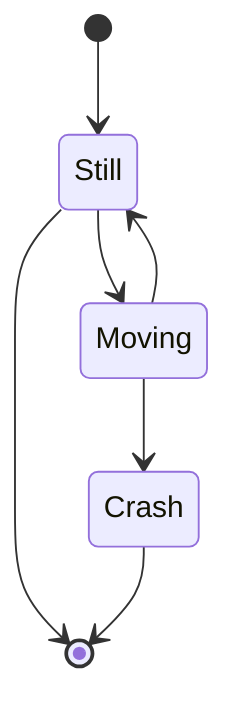

# 2022 S.T. Yau High School Science Award (Asia)

Research Report  

## The Team

Registration Number: Comp-102 

Name of team member: Chuang Po Cheng 
School: Kaohsiung Municipal Senior High School 
Country: Taiwan (The R.O.C) 

Name of team member: Chiu Lu Ming 
School: Kaohsiung Municipal Senior High School 
Country: Taiwan (The R.O.C) 

Name of team member: Hsu Yu Chia 
School: Kaohsiung Municipal Senior High School 
Country: Taiwan (The R.O.C) 

Name of supervising teacher: Lu Cheng Liang 
Job Title: Physics teacher 
School: Kaohsiung Municipal Senior High School 
Country: Taiwan (The R.O.C) 

 

## Title of Research Report
**Calculate when the stunning colorful cloud will appear.** 

> Chuang Po Cheng, Chiu Lu Ming, Hsu Yu Chia 

## Abstract  

Cloud is one of the amazing natural phenomena on Earth. However, we often miss it because of the daily work or so. Therefore, we want to create a system to predict the appearance of clouds. First, we will build up two models, one is to classify the clouds, and the other is to calculate which incidence angle of the sunlight will make the cloud look colorful. After creating both models, we will use some variants, including but not limited to GPS location, time, date, temperature, and humidity. GPS location is mainly used to check what kind of cloud is above their heads from the model. Another way to use the GPS location is to combine the date. Thus, we can calculate the incidence angle of sunlight. Both temperature and humidity are important to calculate the refraction in the atmosphere. Therefore, after combining the height of the clouds and the refraction in the atmosphere, we can predict when the colorful cloud will appear. 

 
+ Keywords: 
 > Computer Vision, Atmosphere Remote Sensing, Cloud Classification, Nature Beauty. 

## Acknowledgement

--------------------------------------------------------------------------------------------------------------------------

## Commitments on Academic Honesty and Integrity

We hereby declare that we  

1. are fully committed to the principle of honesty, integrity and fair play throughout the competition.  

2. actually, perform the research work ourselves and thus truly understand the content of the work.  

3. observe the common standard of academic integrity adopted by most journals and degree theses.  

4. have declared all the assistance and contribution we have received from any personnel, agency, institution, etc. for the research work.  

5. undertake to avoid getting in touch with assessment panel members in a way that may lead to direct or indirect conflict of interest.  

6. undertake to avoid any interaction with assessment panel members that would undermine the neutrality of the panel member and fairness of the assessment process.  

7. observe the safety regulations of the laboratory(ies) where the we conduct the experiment(s), if applicable.  

8. observe all rules and regulations of the competition.  

9. agree that the decision of YHSA(Asia) is final in all matters related to the competition.  

**We understand and agree that failure to honour the above commitments may lead to  disqualification from the competition and/or removal of reward, if applicable; that any unethical  deeds, if found, will be disclosed to the school principal of team member(s) and relevant parties if  deemed necessary; and that the decision of YHSA(Asia) is final and no appeal will be accepted.**  
  
--------------------------------------------------------------------------------------------------------------------------

## Table of Contents
[2022 S.T. Yau High School Science Award (Asia)](#2022-S.T.-Yau-High-School-Science-Award-(Asia))

[The Team](##The-Team)

[Title of Research Report](##Title-of-Research-Report)

[Abstract  ](##Abstract--)

[Acknowledgement](##Acknowledgement)

[Commitments on Academic Honesty and Integrity](##Commitments-on-Academic-Honesty-and-Integrity)

[Table of Contents](##Table-of-Contents)

[Introduction](##Introduction)

- 1.1. [1.1 How the colorful cloud appears](###1.1-How-the-colorful-cloud-appears)

- 1.2. [1.2 Theory](###1.2-Theory)
	- 1.2.1. [1.2.1 Light refraction](####1.2.1-Light-refraction)
	- 1.2.2. [1.2.2 Light scatter](####1.2.2-Light-scatter)
	- 1.2.3. [1.2.3 Refraction index](####1.2.3-Refraction-index)
	- 1.2.3. [1.2.3 The relation between time and solar altitude](####1.2.3-The-relation-between-time-and-solar-altitude)

- 1.3. [1.3 Panoply](###1.3-Panoply)

[2. Approach](##2.-Approach)

- 2.1. [2.1 Motivation](###2.1-Motivation)

- 2.2. [2.2 Data Accessing - Sunrise and Sunset Times](###2.2-Data-Accessing---Sunrise-and-Sunset-Times)
	- 2.2.1. [2.2.1 Data.gov.tw](####2.2.1-Data.gov.tw)
	- 2.2.2. [2.2.2 Data access](####2.2.2-Data-access)

- 2.3. [2.3 Data Accessing - Pressure and Dry Temperature](###2.3-Data-Accessing-–-Pressure-and-Dry-Temperature)
	- 2.3.1. [2.3.1 FORMOSAT-7](####2.3.1-FORMOSAT-7)
	- 2.3.2. [2.3.2 Download the file](####2.3.2-Download-the-file)
	- 2.3.3. [2.3.3 Analyze the file to extract the Information](####2.3.3-Analyze-the-file-to-extract-the-Information)

- 2.4. [2.4 Data Access - Cloud Height](###2.4-Data-Access-–-Cloud-Height)2.4 Data Access – Cloud Height
	- 2.4.1. [2.4.1 AccuWeather](####2.4.1-AccuWeather)
	- 2.4.2. [2.4.2 Data access](####2.4.2-Data-access)

- 2.5. [2.5 Refrction index](###2.5-Refrction-index)

- 2.6. [2.6 Simulation](###2.6-Simulation)
	- 2.5.1. [2.5.1 Light route in atmosphere](####2.5.1-Light-route-in-atmosphere)
	- 2.5.2. [2.5.2 Time-incident angle table](####2.5.2-Time-incident-angle-table)

[3 Result](##3-Result)

[3.1 Model preference](##3.1-Model-preference)

[Reflection](##Reflection)
- Idea. [Idea creator](###Idea-creator)
- Team. [Team leader](###Team-leader)
- Physics. [Physics model](###Physics-model)
- Simulation. [Simulation](###Simulation)
- Result. [Result](###Result)

[4 References](##4-References)


-------------------------------------------------------

## Introduction

### 1.1 How the colorful cloud appears

First, we have to know how the color cloud appear. It is because the light from the sun being scattered during traveling through the atmosphere, and the light with the longer wavelength, usually red light, have a smaller refraction angle. Therefore, the different wavelength of light will reflect from the different horizonal level of color cloud, which make the color different. Here comes the picture illustrate about it. From the daily observing, we notice that colorful cloud usually appears after the rain or typhoon, water vaper pressure especially. 


The picture above is the sunset with some colourful cloud but without rich water vaper. How this scenery appear we think it’s because the height of the cloud, making the light can have enough scattered before reflecting.  


The picture above, in contrast, is with the rich water vaper in the atmosphere. Therefore, create the multi-colour cloud even the cloud is in the low atmosphere. This kind of cloud is cumulonimbus, which usually appear in the low-level atmosphere. Note: this is pictured at 8/23, 18:30.


As the illustration above, we can see the different position on the Earth, which symbolize the different time of the day, has the different light route, the red line. The different light route is caused by the different refraction of the atmosphere. However, different refraction phenomenon is not only due to the different time, but also the different atmosphere variants, such as air pressure, air temperature, humidity and so on. Fortunately, we got the access to the Formosa No.7 satellite, which contained the data, including air refraction index.    

### 1.2 Theory

The theories we used can be category with light refraction, both scatter and refraction are cause from refraction. So we use the below equatoin:

$$ N_{n}\times\sinθ_{n}=N_{n+1}\times\sinθ_{n+1}$$
(1.2.0.1)

where $N_n$ is thee current medium(level) refraction index and $θ_{n}$ is the incident angle. Similarily, ${n+1}$ is the next medium(level). And the equatiion is give by []. And the below are some detailed descriptions. 

#### 1.2.1 Light refraction

Light would refract through different medium. However, different air density or air molecule can be considered to be different medium, too. Therefore, the light refract in the atmosphere is the multi-scattering. Hence, we have to use integration to calculate it. By the way, the density of atmosphere is an exponential distribution.  

#### 1.2.2 Light scatter

If the sunlight beam going through the triangle glass, it will produce a rainbow-like light phase, and it is caused by the different wavelength. 

#### 1.2.3 Refraction index

Due to the refraction index would be majority affected by the wavelength, our purpose as well, we use Cauchy Equation [3] to calculate our refraction index to decrease the miscalculating. And the below is the Cauchy Equation: 

$$ n_{air}(λ, T, v, p)≈1+( \frac\\{T}{77.6 \times\\10^{−6}})(1+ \frac\\{7.52\times10^−3}{λ^2})(p+4810\times\ \frac\\{v}{T}) $$ 
(1.2.3.1)

where  $λ$ is wavelength, using 700 nm or 700000 μm as red-light wavelength, and the equation is using μm as the unit of wavelength, $T$ is temperature, $p$ is air pressure, and $v$ is the pressure of water vapor. However, we couldn’t get the $v$ directly, so we use the below equation [4] : 

$$v=-\frac{1}{ρg}∫_{p_2}^{p_1}M_pdp $$ (1.2.3.2)

Where $v$ is precipitable water vapor ($cm$), $g$ is the acceleration due to the earth’s gravity (986.665 $cm/sec^2$), $ρ$ is the density of liquid water ($g/cm^3$),$p$ is the atmospheric pressure along altitude ($mbar$),$P_1$ and $P_2$ are the atmospheric pressure at the surface and the top of the atmosphere respectively. $M_p$ is mixing ratio at the pressure level, $p$. The integration is from the surface at $P_1$ up to the pressure designated by $P_2$ which depends on the final altitude reached by the radiosonde observation. $M_p$ can be calculate by below: 

$$ M_p=\frac{0.622\times e}{p−e} $$ (1.2.3.3)

Where $e$ is the actual vapor pressure ($mbar$ ). The actual vapor pressure is obtained as the product of the saturated vapor pressure ($e_s$) and the relative humidity ($RH$) at pressure $p$

$$ e=\frac{RH\times e_x}{100} $$ (1.2.3.4)

The saturated vapor pressure value depends only on the air temperature ($T$) in degree Celsius. The saturated vapor pressure (in $mbar$) is calculated according to below: 

$$ e_X=6.112\exp(\frac{17.67\times T}{T+243.5})$$ (1.2.3.5)

#### 1.2.3 The relation between time and solar altitude

To compute solar altitude angle, we need observer’s latitude, time, and date of year. After accessing the above variable, we can compute it in the following formula:       

$$θ=\arcsin(\sinδ \sinϕ+\cosδ \cosϕ \cosω) $$

where $δ$ is the declination angle, $ϕ$ is the latitude angle, and $ω$ is the hour angle. 

The declination angle changing depends on seasons, due to earth revolution. It is the angle between the latitude of direct sunlight and earth’s equator.  The northern latitude to the earth’s equator is positive, and the southern latitude is negative. If axis of the earth were not askew, the declination angle would not exist (picture 1). The declination angle depends on the date of the year($d$), and it is not related to the observer’s location. For instance, $d=1$ means 1 of January.  

$$δ=−0.40928\cos(\frac{2π}{365(d+10)})$$ 

Picture 1 

 Declination angle can transform the local solar time into sun’s moving angle, noted that sun travel $2π24$ rad. per hour. In the midday, Declination angle is zero and therefore it can be calculated easily through the below equation, which $t$ is the local time.  

$$ω=\frac{π}{12(t−12)}$$	 

By the above formulas, we could easily compute by Python, and draw the data as linear graph. The following picture is the linear graph while/when the observer in 23.5°N. The horizontal axis is time of the day (unit: hour). The vertical axis is solar altitude angle computed by the above formulas (unit: radian).   The vertical axis is solar altitude angle computed by the above formulas (unit: radian). The blue line is the day of summer solstice; the rea one is the day of spring equinox; the green one is the day of winter.   

By the above formulas, we could easily compute through Python, and draw the data as line graph. The following is the line graph while the observer in 23.5°N. The horizontal axis is time of the day (unit: hour). The vertical axis is solar altitude angle computed by the above formulas (unit: radian). 

The vertical axis is solar altitude angle computed by the above formulas (unit: radian). The blue line is the day of summer solstice; the rea one is the day of spring equinox; the green one is the day of winter solstice.   

(picture)

### 1.3 Panoply

In this research, we use a lot of data obtained from satellite or other open data platform. These data were usually store in some unfamiliar type, including netCDF, HDF, GRIB. Although these types are able to be read into Python, it is better for us to understand the framework of the data before coding. Panoply (https://www.giss.nasa.gov/tools/panoply/) is the best application released by NASA for preprocessing in this situation. It can read multiple data types, including most of the open data in astronomy and meteorology. Panoply is able to turn single data not only into plots, but also export into CSV. 

(picture)

## 2. Approach

### 2.1 Motivation

Why we want to make this project is because we don’t want to miss the colourful cloud, which is such a practical motive. Also, in our opinion, watching sunset or sunrise accompanied with the colourful cloud is a relaxing hobby for the students who is preparing for the college admission. However, the relaxing moment couldn’t be very long due to the below poem.  

    向晚意不適，驅車登古原。 
		夕陽無限好，只是近黃昏。     	-- by 李商隱 

Therefore, we want to create a program which can predict or calculate when the colorful cloud would appear precisely. Aimed to the precise time. Hence, the project is birth. 

### 2.2 Data Accessing - Sunrise and Sunset Times

(picture)

The most important cause of the stunning colorful cloud is the light right from the sun. Therefore, it is important for our research to know the time of sunrise and sunset. 

#### 2.2.1 Data.gov.tw

Data.gov.tw is an online open data platform established by Taiwanese government in order to release data to public based on The Freedom of Government Information Law. The platform provides multiple types of data, including CSV, XML and JSON. 

#### 2.2.2 Data access

The platform provides permanent link for users to download the latest data. After downloading the data in JSON from the link, we encode it into dictionary in python. In dictionary, it is easy for us to access the current data by importing the current time with time module. Due to the data which has already sorted out in cities, we export the current data in CSV files by cities. 

 

### 2.3 Data Accessing – Pressure and Dry Temperature

Base on the below paragraph, we can access the data of current atmospheric pressure and dry temperature with Formosat-7. There are two different system that we can access are target data, including Formosat-7 TDPC, Formosat-7 TROPS. After our discussion, Formosat-7 TDPC is our first choice, according to its stability and more advanced property. 


```flow
op0=>operation: Analyze and enter the url of the latest folder
op1=>operation: Analyze the latest url, and downloat it.
op2=>operation: Format the file to the readable format.
op3=>operation: Import the file and extract the information to csv.
e=>end

op0->op1->op2->op3->op0
```

The only way we can access the latest data is through its official download site. In this situation we tend to use Python for our coding language, due to its richness module database, consisting of wget , request and netCDF4. 

#### 2.3.1 FORMOSAT-7

(picture)



The Formosat-7 is a major international collaborative space program between Taiwan (the R.O.C) and the USA, aimed for creating a high reliability meteorological satellite system. All six satellite of Formosat-7 system orbit the Earth for about 97 minutes, and could provide about 4000 data per day between 50 degrees north and south latitudes. By measuring radio occultation signals, atmospheric parameters, including refractivity, dry pressure and temperature, humidity, and the electron concentration of the ionosphere can be derived. Users can approach the data from Taiwan Data Processing Center (https://tacc.cwb.gov.tw).  

#### 2.3.2 Download the file

First, we have to get the folder URL. In this situation, we have to import Requests Module to access the website information. Due to the characteristic of the URL under this condition, the target we need to get was only the name of the latest file. After reaching the target with Beautiful Soup Module, we combine it with the base URL to get the folder URL. After then, we do the exactly same steps we did above to get the file URL. Last but not least, we download the file with the file URL with Wget Module. 

#### 2.3.3 Analyze the file to extract the Information

After achieving the file, we have to analyze and extract it to get the information we need. First, we analyze it with Panoply, an app released by NASA (https://www.giss.nasa.gov/tools/panoply/). After we got the information we need, we import and read the file into python by netCDF4 module. The data we took out would be store in list and export in CSV form for later simulating. 

 ``` python
 
 ```

### 2.4 Data Access – Cloud Height

After calculating the route of the light, we have to know the current height of the cloud in order to know whether the cloud would reflect the color of the light. Therefore, if we want to simulate the stunning clouds, it is important for us to know the height of the cloud.  

#### 2.4.1 AccuWeather

There are many different ways to access the data, including commercial weather forecast, aviation weather forecast and the data released from the satellite. AccuWeather is a company aimed in providing accurate commercial weather forecast, which also runs a free, advertising-supported website (AccuWeather.com). The website is based on weather information from numerous sources, including National Weather Service (NWS) and other reliable meteorological organizations. 

#### 2.4.2 Data access

(flow picture)

There are several module for users to crawl in the internet, including Requests, which we used in the above paragraph.  

### 2.5 Refrction index

Mainly, we use `python` to calculate the whole calculation, and `csv` file to connect between different calculation. And the below are the calculations metioned at [1.2].

First, the Cauchy's equation mentioned at (1.2.3.1)

``` python=
def Cauchy_equation(air_pressure,air_temperature,wavelength,relative_humidity):

    T = air_temperature
    w = wavelength
    a = air_pressure
    v = pressure_of_water_vapour(relative_humidity,T)  

    return 1+(0.0000776/T)*(1+(0.00752)/w/w)*(a+4810*v/T)
```

`air_temperature`, `air_pressure` are given by [2.4.1] AccuWeather, which is related with the altitude, different altitude layer would have different temperature and pressure.

``` python=
def pressure_of_water_vapour(relative_humidity,temperature):

    RH= relative_humidity
    T = temperature

    es=6.112*np.exp(17.67*T/(T+243.5))    # saturated vapor

    e = RH*es/100                         # actual vapor pressure

    Mp = 0.662*e/(a-e)                    # mixing ratio at the pressure level, p

    return -1/986.665*Mp

```

As for the integration at (1.2.3.2), becsause of the temperature and pressure are alter in the small gap, 20 meters, so we choose to it as the gap in numerical method for the integration as below code. 

```python=
for i in range(0,3899):

    air_pressure        = float(pressure[i])
    air_temperature     = float(temperature[i])+273.0
    wavelength          = 700*1000.0
    relative_humidity   = 0.7

    refractive_index.append(Cauchy_equation(
        air_pressure        = air_pressure,
        air_temperature     = air_temperature,
        relative_humidity   = relative_humidity,
        wavelength          = wavelength
        )
    )
```

Because the colourful cloud is often caused by the res-light, we use 700 nm as the wavelength of light. As for the humidity, we use 70% or 0.7, which is normally in Kaohsioung, Taiwan, for the test.

### 2.6 Simulation

When we are thinking how to present, we didn’t have any access to the professional software which can run the completive simulation, we don’t know how to conduct it as well. Therefore, we use the simple but powerful way “Matplotlib” to conduct it. And the link is connected to the code.   

#### 2.5.1 Light route in atmosphere

The mainly idea is using the light vector reflecting from the target cloud to reverse the light route during traveling through the atmosphere. After we reverse the light route, we can calculate the incident angle and therefore access the time from the time-angle table at [2.4.2.] Also noted that the main colourful cloud is reflect the near-red light, so we use the refraction index which has been adjust to the red-light wavelength 700 nm by the Cauchy Equation mentioned at [1.2.2]. 

How we use the refraction index is as below equation, where 
$Nn$ and $N_{n+1}$ is the refraction index in the current and the next level. 

$$ N_{n}×\sinθ_{n}=N_{n+1}×\sinθ_{n+1}  ⇒  \sinθ_{n}=N_{n+1}×\sinθ_{n+1}×N_{n} $$ 

(picture)

But there are some initial setups you need to know before understand the code. The observer $O$ is at $(0.0)$ and the target cloud we want to observe is at $P$ $(x,y)$. If we connect the $O$ and $P$ together, we can get the vector $V_0$ which can be used to calculate the reflect angle $θ$. 

(picture)

After we have the reflect angle $θ$, we can use the equation above, using the current and the next level refraction index $N_n$ to calculate the next level’s refraction angel $θ_{n+1}$ , and then doing it again and again until reaching the top of the atmosphere. As the result, we can connect all the vector together, and get the below picture, simulating the light route.  

#### 2.5.2 Time-incident angle table


## 3 Result

As for the result, we use our program to predict the colourful cloud in these days. Here comes our example.  

Example 1: 

| Date | Air pressure | Relative humidity | Incidence angle| Predict time | Simulate time| 
| ---- | ------------ | ----------------- |----------------|--------------|--------------|
| 8/26 |              |                   |                |              |              | 

(picture) 


Example 2: 
| Date | Air pressure | Relative humidity | Incidence angle| Predict time | Simulate time| 
| ---- | ------------ | ----------------- |----------------|--------------|--------------|
| 8/26 |              |                   |                |              |              |

(picture) 


Example 3: 

| Date | Air pressure | Relative humidity | Incidence angle| Predict time | Simulate time| 
| ---- | ------------ | ----------------- |----------------|--------------|--------------|
|      |              |                   |                |              |              |

(picture) 


Example 4: 
| Date | Air pressure | Relative humidity | Incidence angle| Predict time | Simulate time| 
| ---- | ------------ | ----------------- |----------------|--------------|--------------|
|      |              |                   |                |              |              |

(picture)  


Example 5: 
| Date | Air pressure | Relative humidity | Incidence angle| Predict time | Simulate time| 
| ---- | ------------ | ----------------- |----------------|--------------|--------------|
|      |              |                   |                |              |              |
 
(picture)


Example 1: 

| Date | Air pressure | Relative humidity | Incidence angle| Predict time | Simulate time| 
| ---- | ------------ | ----------------- |----------------|--------------|--------------|
|      |              |                   |                |              |              |

(picture) 

## 3.1 Model preference

------------------------------------------------------------------------------------------------------------------------------------------------

## Reflection

In this project, what I'm responsible can be seperate to three different part: idea creator, leader, simulation and phsics model.

### Idea creator

This idea has been in my head about a year or so. It is came up to me because I really like the colourful cloud, which no one may doubt it, I believe. At first, my model is that creeate a Artificial Visual model to classify the cloud and then estimate the height of the cloud, as the abstract said. After that, we can use the physics model to calculate it. However, I'm not really familiar with it, and not interest in artificial intellengence as well because of the unpredictabe proccess during the hidden layer, therefore I gave up, then. Fortunately, I met my teamate 莊博丞, who is interest in it. At the same time, I'm really appreciated that our supervisor bring up the opportunity which let us meet. 

### Team leader

Because I'm the idea creator, I, naturally, became the leader of the project. When I was distributing the responsibility, I distributed with the ablility, disability, and interesrt as far as I knew. And below are the abiblity and interest to my teammate I knew:

|    name     |                                                        ability                                                                 |
|-------------|--------------------------------------------------------------------------------------------------------------------------------|
|   Yoga Hsu  | 1. good at mathmetic and physics calculation <br> 2. lack of coding and programning experence <br> 3. have a not bad friendship with me|
|Pochen Chaung| 1. familiar with python <br> 2. interest and experenced in artificial intelligence <br> 3. having more time then two of us, because of the grades|

By the way, Yoga Hsu is my friend and classmete in school. He said he want to learn programning and coding, but he lacled of action. Therefore I invited him to this project.

Conclude all the mentioned above, I distributed the resoinsibility as below, seprate into two part:

+ `Cloud classify model`     :  Pochang Chuang
+ `Physics model`   :  Yoga Hsu, and me

Also, this is the very first time that I lead a project. Therefore, I'm not pretty sure whether I have been a food leader in this project, so I ask them to give each other some feedback, including me. And the below are the feedbeck to me:

+ Yoga:

+ 莊博丞:

### Physics model

Before making the physics model, I had to do some research in the precious research in the field we are going to, atmospheric refraction. I did find some detailed paper about it. However, it's a bit too complicated and too hard for a non-native english reader, me. I took a lot of time on exploring how to **read the paper efficiently** rather than let the paper loking at me. In the end, I found a useful tips for me to understand it, taking note. After I taking note on the paper, I began to fully understand what variable works for what. I consider it to the most vital ability for the up coming colledge or acadamic life. 

At first, Pochang had the access to the `FORMOSAT-7`, which contained the refractivty index in every altitude. However, after I used it in simulation, it turned out that this refractivity can't use in red-light refraction, due to the wavelength. I was deseperated, because I did not fimd any useful infomation in atmospheric refraction. In the last week before the submission deadline, somthing mirically happened, I found the Cauchy's equation in Wilipedia. I knew Wilipedia's information can't be used in the acadamic report, so I go to find the relative referance. And guess what, the equation is ture. After conduct it in the refraction model, it worked a lot better then the refractiion index given by the FORMOSAT-7 due to the red-light longer wavelength.

All in all, I only used the three equation to simulate the light:

1. $$ N_{n}\times\sinθ_{n}=N_{n+1}\times\sinθ_{n+1}                                                                 $$ (1.2.0.1)
2. $$ n_{air}(λ, T, v, p)≈1+(\frac{77.6\times10^{−6}}{{T}})(1+\frac{7.52\times10^−3}{λ^2})(p+4810\times\frac{v}{T}) $$ (1.2.3.1)
3. $$ v=-\frac{1}{ρg}∫_{p_2}^{p_1}M_pdp                                                                             $$ (1.2.3.2)

### Simulation

Except for the role of the leader, my aonther duty is do the simulation. This is my first time that use `python` as the main developing language, I usually use `java` as my main language, instead, and this is my very first time, again. In the simmulation I larned how to make a graph fomr `matplotlib.pyplot` and read the `csv file` by `csv`module in python. 

+ `matplotlib.plot`, which I thought as the intro to some mathetic problem, statistic, and data visualization. 
+ `csv` module, I see it as some both frontend and beckend basic in web development.

Actually, in this simulation, I'm not only ding it as the literally meaning, but the diverse learning for `python` language. Honestly, for the one who is a little familiar with the prodramning logic, it is quite a easy task to learn python syntax and the use of module. 

I really appreciate the progress of learning. 

### Result


## 4 References

1. Reference article/book/journal. 
2. Reference article/book/journal. 
3. Reference article/book/journal. 
4. Reference article/book/journal. 
5. Reference article/book/journal. 
6. Reference Trager, Scott. "The Earth's atmosphere: seeing, background, absorption & scattering" (PDF). S.C. Trager. Retrieved 31 May 2022.
7. Reference 
8. Reference article/book/journal. 
9. Reference article/book/journal. Reference article/book/journal. 
